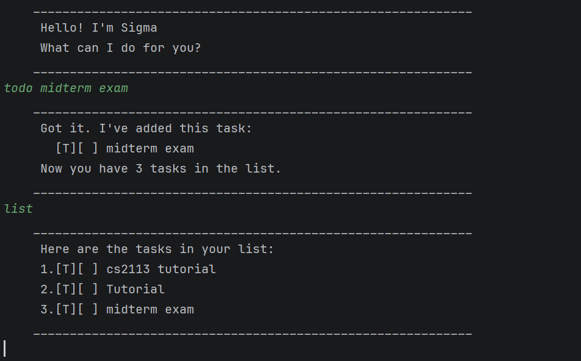

# Sigma User Guide

Sigma is a desktop chatbot application optimized for use via a Command Line Interface (CLI), designed to help you manage and track various types of tasks with ease.



Sigma provides a fast and efficient way to organize your daily schedule. All your data is automatically saved to your hard disk, ensuring your task list is always up-to-date across different sessions.

## Adding deadlines

Adds a task to the list that needs to be completed by a specific date or time.

Example: `deadline [description] /by [time]`

Example: `deadline return book /by Sunday`

Sigma will confirm that the deadline has been added and display the updated total number of tasks in your list.

```
    ____________________________________________________________
     Got it. I've added this task:
       [D][ ] return book (by: Sunday)
     Now you have 1 tasks in the list.
    ____________________________________________________________
```

## Adding todos

Adds a simple task to the list without any specific date or time attached to it.

Example: `todo [description]`

Example: `todo read book`

The task is added with a `[T]` tag, indicating it is a "Todo" item.

```
    ____________________________________________________________
     Got it. I've added this task:
       [T][ ] read book
     Now you have 2 tasks in the list.
    ____________________________________________________________
```

## Adding events

Adds a task that occurs during a specific time frame, with a starting and ending time.

Example: `event [description] /from [start] /to [end]`

Example: `event orientation week /from Mon /to Fri`

The task is added with an `[E]` tag along with its duration details.

```
    ____________________________________________________________
     Got it. I've added this task:
       [E][ ] orientation week (from: Mon to: Fri)
     Now you have 3 tasks in the list.
    ____________________________________________________________
```

## Listing all tasks

Displays every task currently stored in your list, showing their status icons and details.

Example: `list`

A numbered list of all your tasks is printed to the console.

```
    ____________________________________________________________
     Here are the tasks in your list:
     1.[D][ ] return book (by: Sunday)
     2.[T][ ] read book
     3.[E][ ] orientation week (from: Mon to: Fri)
    ____________________________________________________________
```

## Marking tasks as done

Updates the status of a specific task to indicate that it has been completed.

Example: `mark [index]`

Example: `mark 2`

The status icon of the 2nd task changes from `[ ]` to `[X]`.

```
    ____________________________________________________________
     Nice! I've marked this task as done:
       [T][X] read book
    ____________________________________________________________
```

## Unmarking tasks

Changes the status of a previously completed task back to "not done".

Example: `unmark [index]`

Example: `unmark 2`

The status icon of the 2nd task returns to `[ ]`.

```
    ____________________________________________________________
     OK, I've marked this task as not done yet:
       [T][ ] read book
    ____________________________________________________________
```

## Deleting tasks

Removes a specific task permanently from your task list.

Example: `delete [index]`

Example: `delete 1`

The specified task is removed, and the remaining task count is updated.

```
    ____________________________________________________________
     Noted. I've removed this task:
       [D][ ] return book (by: Sunday)
     Now you have 2 tasks in the list.
    ____________________________________________________________
```

## Finding tasks by keyword

Searches for tasks whose descriptions contain a specific keyword.

Example: `find [keyword]`

Example: `find book`

Sigma filters your list and displays only the tasks that match your search term.

```
    ____________________________________________________________
     Here are the matching tasks in your list:
     1.[T][ ] read book
    ____________________________________________________________
```

## Exiting the program

Terminates the chatbot session and ensures all task data is saved to the local file.

Example: `bye`

The program displays a goodbye message and closes.

```
    ____________________________________________________________
     Bye. Hope to see you again soon!
    ____________________________________________________________
```

